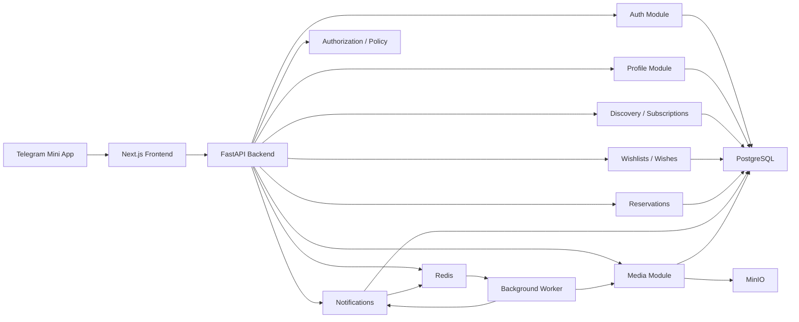

# Wished

Wished is a Telegram Mini App social wishlist platform. It helps users create profiles, share public wishlists, discover wishes from public profiles, reserve gifts without duplicates, copy wishes into their own lists, and coordinate gifting inside Telegram.

The product is a full-stack application with a Next.js frontend, FastAPI backend, PostgreSQL database, Redis cache and coordination layer, Docker-based runtime, and MinIO-compatible object storage.

This README is the canonical product and software architecture document. Infrastructure details live in [INFRASTRUCTURE.md](./INFRASTRUCTURE.md). Agent rules live in [AGENTS.md](./AGENTS.md).

## 1. Product Overview

Gift giving is often fragmented across chats, screenshots, notes, links, and last-minute guesses. People struggle to communicate what they actually want, while gift-givers struggle to choose meaningful gifts without duplicates, awkward coordination, or spoiled surprises.

Wished turns wishlists into a lightweight social experience inside Telegram, where gift planning already happens.

Primary goals:

- Let users authenticate with Telegram.
- Let users create profiles, wishlists, and wishes.
- Let users discover public profiles and public wishlists.
- Prevent duplicate gifting through reservations.
- Hide reservation details from the wish owner.
- Track completed wishes.
- Notify users about relevant social and wishlist activity.

Non-goals for MVP:

- In-app payments.
- Marketplace checkout.
- Native mobile apps.
- Advanced recommendation systems.
- Complex public social networking.

## 2. Target Audience

- Telegram users who exchange gifts with people, families, communities, or colleagues.
- People maintaining wishlists for birthdays, holidays, weddings, baby showers, housewarmings, or personal milestones.
- Groups and families that coordinate gifts in chats.
- Creators or community leaders who may later share curated public wishlists.
- Small merchants or brands that may later participate through product discovery or affiliate links.

## 3. Core Features

- Telegram authentication.
- User profiles.
- Subscriptions to wishlist activity.
- Wishlist creation and management.
- Wish creation and management.
- Reservations to prevent duplicate gifts.
- Hidden reservations from wish owners.
- Completed wishes.
- In-app notifications.
- Optional media uploads backed by MinIO.

## 4. MVP Scope

MVP should support the smallest complete gift coordination loop:

1. A user opens Wished from Telegram.
2. The user signs in with Telegram.
3. The user has a profile.
4. The user creates a wishlist.
5. The user adds wishes.
6. The user makes the wishlist public.
7. Another user opens the profile and public wishlist.
8. The viewer reserves or copies a wish.
9. Other eligible viewers see the wish as unavailable.
10. The wish owner does not see reservation details.
11. The wish can be marked completed.
12. Users receive basic in-app notifications.

Included in MVP:

- Telegram Mini App launch and authentication.
- Basic user profile.
- Wishlist creation, editing, deletion, or archival.
- Wish creation, editing, deletion, or archival.
- Profile discovery and public profile viewing.
- Copying public wishes into owned wishlists.
- Public and private wishlist visibility.
- One active reservation per wish.
- Hidden reservation behavior from the wish owner.
- Completed wish state.
- Basic in-app notifications.
- PostgreSQL-backed durable data.
- Redis for cache, rate limiting, sessions, or background coordination where needed.
- MinIO for user-uploaded media if media uploads are included in MVP.

Excluded from MVP:

- Payments.
- Checkout.
- Price tracking.
- Store integrations.
- Group gifting with shared contributions.
- Advanced privacy controls.
- Blocking and reporting.
- Telegram bot notifications unless separately required.
- Admin dashboard unless separately required.
- Multi-language support unless separately required.

## 5. User Stories

### Authentication

- As a Telegram user, I want to sign in using Telegram so that I do not need a separate account.
- As a returning user, I want Wished to recognize me so that I can continue using my profile.
- As the system, I need to verify Telegram authentication server-side so that users cannot impersonate others.

### Profiles

- As a user, I want to create and edit my profile so that other users can recognize me.
- As a user, I want to view another user's profile so that I can see their available wishlists.

### Subscriptions

- As a user, I want to subscribe to wishlist activity so that I can receive updates.
- As a user, I want to unsubscribe so that I can reduce unwanted notifications.

### Wishlists and Wishes

- As a user, I want to create wishlists so that I can organize wishes by occasion or theme.
- As a user, I want to add wishes with useful details so that gift-givers can make informed decisions.
- As a viewer, I want to see wish details so that I can choose a gift.
- As a viewer, I want to copy a public wish into my own wishlist.

### Reservations

- As a viewer, I want to reserve a wish so that others know it is already planned.
- As a viewer, I want to cancel my reservation if I can no longer buy the gift.
- As the wish owner, I should not see who reserved my wish before completion or reveal.

### Completed Wishes

- As a user, I want to mark a wish as completed so that my active wishlist stays current.
- As a user, I want completed wishes separated from active wishes.

### Notifications

- As a user, I want notifications about wishlist updates and allowed completion activity.
- As a user, I do not want notifications to spoil hidden reservations.

## 6. Business Rules

- A Telegram identity can belong to only one Wished account.
- Telegram identity must be validated by the backend.
- Users can modify only resources they own unless explicitly authorized.
- Users cannot subscribe to themselves unless product policy changes.
- Duplicate subscriptions must be prevented.
- A wishlist belongs to exactly one owner.
- A wish belongs to exactly one wishlist.
- Wishlists are ordered within each user's profile.
- Wishes are ordered within each wishlist.
- A completed, archived, or deleted wish cannot be reserved.
- A user cannot reserve their own wish unless product policy changes.
- MVP allows only one active reservation per wish.
- Reservation details must be hidden from the wish owner.
- Gift-givers may see that a wish is unavailable to prevent duplicate gifts.
- Notifications must be created only for users authorized to know about the event.
- Hidden reservation activity must not leak through notifications, counts, timestamps, sorting, or activity feeds.
- PostgreSQL is the source of truth for durable business state.
- Redis must not be the source of truth for reservations, users, wishlists, wishes, or notification history.

## 7. Edge Cases

- Telegram authentication data is missing, malformed, expired, or invalid.
- A Telegram user exists but local profile onboarding is incomplete.
- A user deletes a wishlist that contains active or reserved wishes.
- A user edits, deletes, or completes a reserved wish.
- Two users try to reserve the same wish at nearly the same time.
- Wishlist visibility changes after a reservation exists.
- A wish owner views a wishlist after a hidden reservation occurs.
- A notification points to deleted or inaccessible content.
- Media upload succeeds in MinIO but is never attached in PostgreSQL.
- Media metadata exists but the object is missing in MinIO.

## 8. Tech Stack

### Frontend

- Next.js
- TypeScript
- Tailwind CSS
- Telegram Mini Apps SDK
- Zustand
- Tanstack Query

### Backend

- FastAPI
- PostgreSQL
- Redis

### Infrastructure

- Docker
- Docker Compose
- MinIO

## 9. Frontend Architecture

The frontend is a Next.js Telegram Mini App. It should be organized around product capabilities and use backend responses as the source of truth for permissions, visibility, and business state.

Frontend modules:

- App Shell: Telegram runtime initialization, global layout, navigation, providers, loading states, and app entry states.
- Authentication: Telegram init data collection, backend validation request, authenticated frontend state, and onboarding entry.
- Profiles: own profile, other profiles, editable fields, viewer-safe profile display.
- Subscriptions: subscribe, unsubscribe, subscription state, and notification-related preferences.
- Wishlists: owned wishlist listing, accessible wishlist listing, create, edit, archive, delete, and visibility display.
- Wishes: create, edit, archive, delete, wish detail display, active state, unavailable state, completed state, and archived state.
- Reservations: reserve eligible wishes, cancel own reservations, display own reservation state, display unavailable state to gift-givers, and hide metadata from owners.
- Completed Wishes: mark wishes completed and separate completed wishes from active wishes.
- Notifications: notification list, unread count, mark-as-read behavior, and safe links to accessible resources.
- Media Uploads: authorized upload start, upload progress, backend confirmation, and media attachment display.

Frontend rules:

- Do not trust client-provided identity, ownership, or authorization claims.
- Do not hardcode backend URLs, Telegram configuration, secrets, or environment-specific values.
- Use Tanstack Query for server state.
- Use Zustand only for local client state.
- Do not duplicate hidden reservation business rules in the client.

## 10. Backend Architecture

The backend is a FastAPI modular monolith for MVP. Module boundaries should be explicit, but the system should not be split into microservices until there is a proven operational need.

Backend modules:

- API Layer: route handlers, request parsing, response formatting, authentication context, and error mapping.
- Authentication: Telegram init data validation, user resolution, first-login user creation if allowed, and session handling.
- User and Profile: user identity, editable profile data, viewer-specific profile projections, and sensitive metadata protection.
- Subscription: subscriptions, unsubscriptions, and subscription-based notification eligibility.
- Wishlist: wishlist lifecycle, ownership checks, visibility rules, and archive or delete behavior.
- Wish: wish lifecycle, validation, state transitions, completion behavior, and viewer-specific wish projection.
- Reservation: reservation creation, cancellation, one-active-reservation enforcement, concurrency handling, and hidden reservation privacy.
- Notification: domain event consumption, recipient selection, privacy filtering, in-app notification creation, and read state.
- Media: upload authorization, file validation, MinIO coordination, object confirmation, media metadata, and attachment.
- Authorization and Policy: centralized access decisions and viewer-specific visibility rules.
- Event: domain events, event dispatch, and optional Redis-backed async processing.

Backend rules:

- Route handlers should not duplicate hidden reservation or authorization logic.
- Business operations that change state should use transactions where consistency matters.
- Reservation correctness must be enforced through PostgreSQL transactions and constraints.
- Notification content must be generated or validated server-side.
- PostgreSQL metadata is authoritative for media ownership and attachment.

## 11. Service Boundaries

MVP deployment boundary:

- One Next.js frontend service.
- One FastAPI backend service.
- One PostgreSQL database.
- One Redis instance.
- One MinIO service.
- Optional backend worker service using the same backend codebase.

Logical backend boundaries:

- Identity: Telegram authentication, users, and profiles.
- Discovery: profile search, public profile viewing, and subscriptions.
- Wishlist: wishlists, wishes, and completed wishes.
- Reservation: reservations and hidden reservation privacy.
- Notification: event consumption, notification creation, and read state.
- Media: upload authorization, object metadata, and object attachment.
- Policy: access control and viewer-specific projections.

Future extraction candidates:

- Notifications.
- Media.
- Search and discovery.
- Recommendations.
- Analytics.

Reservation logic should remain close to wish data unless a distributed consistency design is explicitly approved.

## 12. Event Flow

Wished should use domain events for side effects, especially notifications.

General flow:

1. The frontend sends an authenticated request.
2. The backend validates authentication and authorization.
3. The domain module performs the operation inside a transaction when state changes.
4. The domain module records the state change.
5. A domain event is emitted after successful persistence.
6. Event handlers run synchronously or through a Redis-backed worker.
7. Notification handlers create recipient-specific notifications where allowed.
8. Frontend state is refreshed through server-state queries.

Initial event categories:

- Profile events.
- Subscription events.
- Wishlist events.
- Wish events.
- Reservation events.
- Completion events.
- Media events.

Events are for side effects. PostgreSQL remains the source of truth for business state.

## 13. Notification Flow

Notification creation flow:

1. A domain action occurs.
2. A domain event is emitted.
3. The notification module receives the event.
4. Candidate recipients are selected.
5. The policy module filters recipients by access and privacy.
6. Viewer-safe notification content is generated.
7. Notification records are stored.
8. The frontend fetches notifications and unread counts.

Notification privacy rules:

- New wishlist and new wish notifications may go only to subscribers with access.
- Reservation notifications must not go to the wish owner.
- Reservation confirmations may go to the reservation owner if product policy requires them.
- Notification text must not reveal hidden reservation owner, timestamp, notes, cancellation history, or indirect activity signals.

## 14. Reservation Flow

Reservation creation flow:

1. An authenticated user views an accessible wishlist.
2. The backend returns viewer-safe wish state.
3. The user requests to reserve a wish.
4. The backend verifies authentication.
5. The backend verifies the user can view the wish.
6. The backend verifies the user is not the wish owner.
7. The backend verifies the wish is active and not completed, archived, or deleted.
8. The backend verifies no active reservation already exists.
9. The backend creates the reservation inside a transaction.
10. The backend emits a reservation event.
11. Notification handling applies hidden reservation privacy rules.
12. The frontend refreshes the wish state.

Reservation cancellation flow:

1. The reservation owner requests cancellation.
2. The backend verifies ownership of the reservation.
3. The backend verifies cancellation is still allowed.
4. The backend cancels the reservation according to the retention policy.
5. The backend emits a cancellation event.
6. The wish becomes available again if it is still active.

Concurrency requirement:

- If two users try to reserve the same wish at the same time, only one reservation may succeed.
- The losing request should receive the project's standard conflict response.
- The frontend should refresh and show the wish as unavailable.

Wish owner privacy:

- The wish owner must not see who reserved the wish.
- The wish owner must not see reservation notes.
- The wish owner must not see reservation timestamps.
- The wish owner must not see cancellation history.
- The wish owner must not receive reservation notifications.

## 15. File Upload Flow

Recommended MVP upload flow:

1. An authenticated user selects a file.
2. The frontend asks the backend to start an upload.
3. The backend verifies authentication.
4. The backend verifies the target resource can be modified by the user.
5. The backend validates intended file type and size.
6. The backend creates pending media metadata.
7. The backend returns upload instructions.
8. The frontend uploads the object to MinIO using the approved instructions.
9. The frontend tells the backend the upload is complete.
10. The backend verifies the object exists in MinIO.
11. The backend marks the media as uploaded.
12. The backend attaches the media to the target resource.
13. The frontend refreshes the target resource.

Media lifecycle states:

- Pending.
- Uploaded.
- Attached.
- Failed.
- Deleted.

Upload rules:

- Only authenticated users may upload files.
- Users may attach media only to resources they can modify.
- File type and size must be validated.
- Object names must not expose sensitive user data.
- Orphaned pending uploads should be cleaned up.
- MinIO object storage is not the source of truth for media ownership.

## 16. Scaling Strategy

MVP should optimize for simple, reliable operation:

- One frontend container.
- One backend container.
- Optional backend worker container.
- PostgreSQL for durable data.
- Redis for cache, rate limits, sessions, or queue coordination where needed.
- MinIO for object storage.

Backend scaling path:

1. Single backend container.
2. Multiple backend replicas behind a proxy.
3. Separate worker replicas for notifications and media tasks.
4. PostgreSQL read replicas for read-heavy workloads.
5. Extract independent services only after module-specific scaling pressure is proven.

Database scaling priorities:

- Transactional reservation creation.
- Constraint-backed prevention of duplicate active reservations.
- Indexed ownership lookups.
- Indexed notification recipient and read-state queries.
- Pagination for unbounded lists.

Redis may support cache entries, rate limiting, shared sessions, background job queues, and short-lived coordination. Redis must not be the source of truth for durable business state.

MinIO scaling path:

1. Single local or MVP instance.
2. Persistent volume-backed deployment.
3. Lifecycle cleanup for abandoned uploads.
4. Distributed MinIO or managed S3-compatible storage.
5. CDN integration for media delivery if traffic requires it.

Future event reliability pattern:

1. Write domain state and an event outbox record in the same PostgreSQL transaction.
2. Worker reads unprocessed outbox records.
3. Worker processes events idempotently.
4. Worker marks events as processed.
5. Failed events are retried or moved to a dead-letter workflow.

## 17. High-Level System Scheme



## 18. Repository Structure

Recommended repository structure:

```text
wished/
  README.md
  AGENTS.md
  INFRASTRUCTURE.md
  docker-compose.yml
  .env.example
  frontend/
    README.md
    package.json
    src/
  backend/
    README.md
    pyproject.toml
    app/
  infra/
    docker/
```

The exact structure should follow the committed project layout once implementation begins. Do not move files or introduce new top-level directories without a clear project need.

## 19. Local Development Setup

Prerequisites:

- Node.js compatible with the selected Next.js version.
- Python compatible with the selected FastAPI runtime.
- Docker.
- Docker Compose.
- PostgreSQL client tools, optional but useful.
- Redis client tools, optional but useful.

Suggested local setup flow:

1. Copy the environment example file.
2. Configure required environment variables.
3. Start infrastructure services with Docker Compose.
4. Install frontend dependencies.
5. Install backend dependencies.
6. Run database migrations when migrations exist.
7. Start the backend development server.
8. Start the frontend development server.
9. Open the Telegram Mini App development URL in the expected Telegram testing environment.

Exact commands should be defined only after package managers, scripts, and backend tooling are committed.

## 20. Environment Variables

Expected environment variable groups:

- Application: app environment, frontend URL, backend API URL, and allowed origins.
- Telegram: bot token, Mini App configuration, and init data validation settings.
- Database: PostgreSQL host, port, database name, username, password, and connection URL.
- Redis: host, port, password if enabled, and connection URL.
- Object Storage: MinIO endpoint, access key, secret key, bucket name, and public asset URL if applicable.
- Security: application secret, token signing secret if applicable, and cookie or session security settings if applicable.

Concrete variable names must be defined in `.env.example` and kept consistent across frontend, backend, Docker, and deployment configuration.

## 21. Development Workflow

- Keep product behavior documented before implementing it.
- Define API contracts before frontend and backend integration work.
- Wishlist reorder uses `PATCH /wishlists/reorder` with `wishlist_ids`.
- Wish reorder uses `PATCH /wishlists/{wishlist_id}/wishes/reorder` with `wish_ids`.
- Keep frontend and backend changes scoped to the related feature.
- Update documentation when setup, environment variables, or workflows change.
- Add tests for meaningful backend behavior, frontend workflows, and integration boundaries.
- Run formatting, linting, type checks, and tests before merging.
- Do not commit secrets, local environment files, database dumps, or generated storage data.
- Use pull requests for changes that affect shared behavior.
- Keep migrations reviewable and tied to explicit data model changes.

## 22. Future Features

- Public profiles and public wishlists.
- Invite-only wishlists.
- Groups or circles.
- Blocking and reporting.
- Birthday and occasion reminders.
- Activity feed.
- Wishlist templates.
- Priority ranking and manual ordering.
- Collaborative wishlists.
- Wishlist sharing links.
- Reservation expiration and reminders.
- Anonymous reservations.
- Group gifting and contribution tracking.
- Gift reveal after completion.
- Product metadata previews.
- Price tracking.
- Store availability checks.
- Affiliate links.
- In-app checkout.
- Telegram bot notifications.
- Email or push notifications.
- Notification preferences and digests.
- Image resizing and moderation.
- Gift recommendations.
- Admin dashboard and moderation tools.
- Audit logs.
- Browser extension for saving wishes from shopping sites.
- Multi-language and regional currency support.

## 23. Success Metrics

- Number of activated users who create at least one wishlist.
- Wishlist creation rate.
- Average number of items per wishlist.
- Share rate per wishlist.
- Shared wishlist open rate.
- Reservation rate for wishlist items.
- Weekly and monthly active users.
- Retention after first wishlist creation.
- Number of Telegram chats or groups where wishlists are shared.
- Gift coordination completion rate for occasion-based wishlists.
- Percentage of users with more than one wishlist.
- Affiliate click-through rate if affiliate links are introduced.
- Revenue per active user if monetization is introduced.
