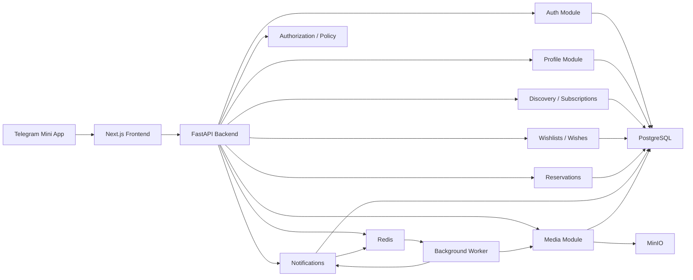

# Wished Infrastructure & Architecture

Technical reference for developers and operators. Product rules and business logic live in [PRODUCT.md](./PRODUCT.md). Agent coding rules live in [AGENTS.md](../AGENTS.md).

## 1. Services

Wished infrastructure is composed of the following services:

- **Telegram Mini App frontend**: User-facing web application loaded inside Telegram.
- **Next.js application**: Frontend application serving Mini App pages and client assets.
- **FastAPI backend**: Backend API for application logic, data access, Telegram validation, and integration workflows.
- **PostgreSQL**: Primary durable relational database.
- **Redis**: Cache, ephemeral state store, rate limiting support, and background coordination layer.
- **MinIO**: S3-compatible object storage for uploaded media and local object storage parity.
- **Reverse proxy / edge layer**: Public HTTP entry point for frontend and backend traffic in production.
- **Backup service**: Scheduled backup process for PostgreSQL and MinIO data.
- **Monitoring and logging layer**: Operational visibility for health, errors, resource usage, and audit trails.

## 2. Containers

Development (`docker/docker-compose.yml`):

- **backend** — FastAPI application; validates Telegram init data, exposes API, connects to PostgreSQL, Redis, and MinIO.
- **caddy** — Reverse proxy; routes public HTTP/HTTPS traffic to frontend and backend, handles TLS.
- **postgres** — PostgreSQL; primary durable store, dedicated persistent volume.
- **redis** — Redis; cache, rate limiting, ephemeral coordination.
- **minio** — MinIO object storage; stores uploaded media, dedicated persistent volume.
- **bot** — Telegram bot worker; runs background tasks and bot interactions.

Production additions (`docker/docker-compose.prod.yml`):

- **minio-init** — One-time setup container; creates required MinIO buckets and policies.
- **backup** — Scheduled backup jobs; exports PostgreSQL and MinIO data to external storage.

## 3. Network Layout

The infrastructure should use separated network zones:

- **Public network**
  - Exposes only the reverse proxy or public application entry point.
  - Receives Telegram Mini App browser traffic.
  - Receives API requests from the frontend.

- **Application network**
  - Connects frontend and backend services.
  - Allows the proxy to route traffic to frontend and backend.
  - Not directly exposed to the public internet.

- **Data network**
  - Connects backend to PostgreSQL, Redis, and MinIO.
  - Isolated from public traffic.
  - Database, Redis, and MinIO ports should not be publicly exposed in production.

Traffic flow:

1. Telegram opens the Mini App URL.
2. User traffic reaches the public HTTPS endpoint.
3. The proxy routes frontend requests to Next.js.
4. The frontend calls the backend API.
5. The backend validates Telegram data and handles application requests.
6. The backend reads and writes PostgreSQL data.
7. The backend uses Redis for cache or ephemeral coordination.
8. The backend stores and retrieves media through MinIO.

## 4. Environment Variables

See [`.env.example`](../.env.example) — authoritative reference for all variables, their defaults, and inline documentation.

Copy it to `.env` and fill in the required values before running locally.

## 5. Storage Structure

Storage should be separated by data type and lifecycle.

### PostgreSQL Storage

- Application relational data.
- User records.
- Wishlist records.
- Wishlist item records.
- Reservation or coordination records.
- Audit or event data only if explicitly required by product design.

Database storage must be persistent and backed up regularly.

### Redis Storage

- Cache entries.
- Ephemeral workflow state.
- Rate limit counters.
- Background coordination data.

Redis should not be the only source of truth for critical business data.

### MinIO Storage

Recommended bucket separation:

- **wished-media**
  - User-uploaded wishlist item images.
  - Profile or wishlist media if supported.

- **wished-system**
  - Internal generated assets if needed.
  - Non-public system objects.

- **wished-backups**
  - Optional local backup staging bucket for development only.
  - Production backups should be copied to external durable storage.

Object paths should be predictable, scoped by entity type, and avoid exposing sensitive identifiers unnecessarily.

## 6. Volumes

Required persistent volumes:

- **postgres-data**
  - Stores PostgreSQL database files.
  - Must be backed up.

- **redis-data**
  - Stores Redis persistence files if Redis persistence is enabled.
  - Optional for purely ephemeral Redis usage.

- **minio-data**
  - Stores MinIO object data.
  - Must be backed up.

- **backup-data**
  - Temporary local backup staging area.
  - Should not be the only backup location.

Optional volumes:

- **proxy-certs**
  - Stores TLS certificates for self-hosted production.

- **proxy-logs**
  - Stores proxy logs if logs are file-based.

- **app-logs**
  - Stores application logs if logs are file-based.
  - Prefer centralized logging in production.

## 7. Backup Strategy

### PostgreSQL

- Run scheduled logical backups.
- Store backups outside the application host.
- Encrypt backups before or during transfer.
- Retain multiple restore points.
- Test restore procedures regularly.
- Keep backup retention aligned with business and compliance requirements.

Recommended backup tiers:

- Frequent short-retention backups for operational recovery.
- Daily medium-retention backups.
- Longer-retention backups for disaster recovery.

### MinIO

- Back up buckets through object replication, snapshotting, or scheduled sync.
- Store production object backups in external durable storage.
- Preserve metadata needed by the application.
- Include bucket policy and lifecycle configuration in infrastructure documentation.

### Redis

- Back up Redis only if it contains data that must survive restarts.
- If Redis is strictly ephemeral, prioritize fast recreation over backup.

### Verification

- Backups are not valid until restore has been tested.
- Restore testing should include PostgreSQL and MinIO together to confirm data consistency.
- Document recovery time objective and recovery point objective once business requirements are known.

## 8. Development Setup

Development infrastructure should prioritize reproducibility and low setup cost.

Development services:

- Next.js frontend container or local frontend process.
- FastAPI backend container or local backend process.
- PostgreSQL container.
- Redis container.
- MinIO container.
- Optional MinIO initialization container.

Development expectations:

- Use Docker Compose for shared infrastructure.
- Use local environment files excluded from Git.
- Provide an example environment file with non-secret placeholders.
- Expose service ports only for local development needs.
- Persist PostgreSQL and MinIO data across container restarts.
- Allow easy reset of local volumes when a clean environment is needed.
- Keep Telegram local testing requirements documented.
- Use HTTPS tunneling or an approved public development URL when Telegram requires a public Mini App endpoint.

Development data:

- Use seed data only when explicitly defined.
- Do not use production credentials.
- Do not connect local development to production databases, Redis, or object storage.

## 9. Production Setup

Production infrastructure should prioritize security, durability, observability, and controlled deployment.

Production services:

- Public reverse proxy or managed edge service.
- Next.js frontend runtime.
- FastAPI backend runtime.
- Managed or self-hosted PostgreSQL.
- Managed or self-hosted Redis.
- Managed object storage or hardened MinIO deployment.
- Backup runner or managed backup service.
- Monitoring, logging, and alerting stack.

Production requirements:

- Serve Telegram Mini App over HTTPS.
- Keep database, Redis, and MinIO private.
- Store secrets in a secure secret manager or protected deployment environment.
- Run database migrations through a controlled release process.
- Configure health checks for frontend, backend, PostgreSQL, Redis, and MinIO.
- Configure centralized logging for application and infrastructure services.
- Monitor API latency, error rates, container health, database performance, Redis memory, and object storage usage.
- Apply least-privilege access for MinIO buckets and service credentials.
- Use separate environments for development, staging, and production.
- Avoid sharing credentials across environments.
- Define a rollback process for application releases.
- Define a disaster recovery process for data restoration.

Production deployment topology may start as a single Docker Compose host for early-stage operation, but should be designed so PostgreSQL, Redis, object storage, and application services can later be migrated to managed or independently scaled infrastructure.

---

## Application Topology

Service composition and data flows for the running system. For code-level module structure, file paths, and data flow through the codebase, see [AGENTS.md](./AGENTS.md).

### System Diagram



---

## Scaling Strategy

Backend scaling path:

1. Single backend container.
2. Multiple backend replicas behind a proxy.
3. Separate worker replicas for notifications and media tasks.
4. PostgreSQL read replicas for read-heavy workloads.
5. Extract independent services only after module-specific scaling pressure is proven.

Database scaling priorities:

- Transactional reservation creation.
- Constraint-backed prevention of duplicate active reservations.
- Indexed ownership lookups.
- Indexed notification recipient and read-state queries.
- Pagination for unbounded lists.

Redis may support cache entries, rate limiting, shared sessions, background job queues, and short-lived coordination. Redis must not be the source of truth for durable business state.

MinIO scaling path:

1. Single local or MVP instance.
2. Persistent volume-backed deployment.
3. Lifecycle cleanup for abandoned uploads.
4. Distributed MinIO or managed S3-compatible storage.
5. CDN integration for media delivery if traffic requires it.

Future event reliability pattern (outbox):

1. Write domain state and an event outbox record in the same PostgreSQL transaction.
2. Worker reads unprocessed outbox records and processes events idempotently.
3. Worker marks events as processed; failed events are retried or dead-lettered.

---

## Repository Structure

```text
wished/
  README.md
  AGENTS.md
  docs/
    PRODUCT.md
    INFRASTRUCTURE.md
  .env.example
  backend/
    pyproject.toml
    app/
  frontend/
    package.json
    src/
  infra/
    backup/
    caddy/
  deploy/
  docker/
    docker-compose.yml
    docker-compose.prod.yml
    *.Dockerfile
  tests/
  scripts/
  .github/
```

Do not move files or introduce new top-level directories without a clear project need.

---

## Development Workflow

- Keep product behavior documented before implementing it.
- Define API contracts before frontend and backend integration work.
- Wishlist reorder uses `PATCH /wishlists/reorder` with `wishlist_ids`.
- Wish reorder uses `PATCH /wishlists/{wishlist_id}/wishes/reorder` with `wish_ids`.
- Keep frontend and backend changes scoped to the related feature.
- Update documentation when setup, environment variables, or workflows change.
- Add tests for meaningful backend behavior, frontend workflows, and integration boundaries.
- Run formatting, linting, type checks, and tests before merging.
- Do not commit secrets, local environment files, database dumps, or generated storage data.
- Use pull requests for changes that affect shared behavior.
- Keep migrations reviewable and tied to explicit data model changes.

---

## Disaster Recovery

### Objectives

| Metric | Target |
|--------|--------|
| RPO (Recovery Point Objective) | ≤ 6 hours (backup interval) |
| RTO (Recovery Time Objective) | ≤ 2 hours |

### Backup Architecture

```
PostgreSQL ──► pg_dump (custom format, compressed)
                    │
                    ▼
MinIO ──────► mc mirror
                    │
                    ▼
             /var/backups/wished/{timestamp}/    ← host path, NOT a Docker volume
                    │
                    ▼ (if BACKUP_EXTERNAL_ENABLED=true)
             External S3-compatible bucket       ← survives server loss
```

**Critical design decision:** Backups land on a **host bind-mounted path** (`/var/backups/wished`), not a named Docker volume. This means `docker compose down -v`, `docker volume rm`, and `docker system prune -a` cannot destroy local backups.

### Backup Contents

Each timestamped backup directory contains:

```
/var/backups/wished/
└── 2026-06-22_12-00/
    ├── postgres.dump       pg_dump custom format, compressed
    ├── manifest.json       metadata for verification
    └── minio/
        ├── wished-media/   user-uploaded images
        └── wished-system/  system objects
```

### Common Failure Scenarios

**`docker compose down -v` run accidentally**
Impact: all named Docker volumes deleted. Local backups in `/var/backups/wished` survive (host path). Proceed to full restore below.

**Server lost / disk failure**
Impact: everything gone including local backups. Requires `BACKUP_EXTERNAL_ENABLED=true`. Copy the latest backup from external S3 to `/var/backups/wished/` on the new server, then restore.

**Accidental data deletion (application level)**
Restore from the last backup taken before the deletion. RPO = backup interval.

**Bad migration applied**
Stop all application containers immediately, restore from the last pre-migration backup, fix the migration before re-deploying.

### Full Restore Procedure

**Prerequisites:** server with Docker + Compose, valid backup in `/var/backups/wished/`, production `.env`.

```bash
# 1 — stop app services (do NOT use down -v)
docker compose -f docker/docker-compose.prod.yml stop backend frontend bot caddy

# 2 — verify backup
docker compose -f docker/docker-compose.prod.yml run --rm backup verify-backup

# 3 — restore PostgreSQL + MinIO (prompts for confirmation)
docker compose -f docker/docker-compose.prod.yml run --rm backup restore latest
# or: ... restore 2026-06-22_12-00

# 4 — run pending migrations if restoring from an older backup
docker compose -f docker/docker-compose.prod.yml run --rm backend alembic upgrade head

# 5 — restart all services
bash deploy/deploy.sh

# 6 — verify health
docker compose -f docker/docker-compose.prod.yml ps
curl -f https://your-domain/api/v1/health
```

### Restore from External Storage

```bash
mc alias set external https://s3.example.com ACCESS_KEY SECRET_KEY
mc mirror external/wished-backups/2026-06-22_12-00/ /var/backups/wished/2026-06-22_12-00/
# then proceed from step 2 above
```

### Routine Backup Verification

Run weekly or after any infrastructure change:

```bash
docker compose -f docker/docker-compose.prod.yml run --rm backup verify-backup
```

Checks: recent backup exists, PostgreSQL dump is structurally valid, backup age is within expected interval.

### Safe Deployment

Always use the deployment script — it never removes volumes:

```bash
bash deploy/deploy.sh
```

Never run:
```bash
docker compose down -v          # destroys all volumes
docker volume rm wished_*       # destroys named volumes
docker system prune -a -f       # destroys everything including volumes
```

### Migration Safety

Before applying migrations to production:

```bash
bash scripts/check-migrations.sh
```

Scans for `drop_table`, `drop_column`, `TRUNCATE`, and mass `DELETE`. Exits non-zero unless `FORCE_DESTRUCTIVE=true`.

### Contacts

| Role | Contact |
|------|---------|
| On-call engineer | — |
| Database owner | — |
| Infrastructure owner | — |
