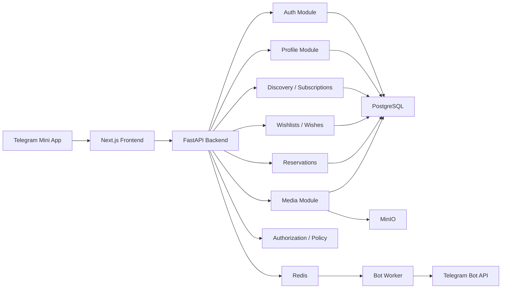

# Wished Infrastructure & Architecture

Technical reference for developers and operators. Product rules and business logic live in [PRODUCT.md](./PRODUCT.md). Agent coding rules live in [AGENTS.md](../AGENTS.md).

## 1. Services

Wished infrastructure is composed of the following services:

- **Telegram Mini App frontend**: User-facing web application loaded inside Telegram.
- **Next.js application**: Frontend application serving Mini App pages and client assets.
- **FastAPI backend**: Backend API for application logic, data access, Telegram validation, and integration workflows.
- **PostgreSQL**: Primary durable relational database.
- **Redis**: Cache, ephemeral state store, rate limiting support, and background coordination layer.
- **MinIO**: S3-compatible object storage for uploaded media and local object storage parity.
- **Reverse proxy / edge layer**: Public HTTP entry point for frontend and backend traffic in production.
- **Backup service**: Scheduled backup process for PostgreSQL and MinIO data.
- **Monitoring and logging layer**: Operational visibility for health, errors, resource usage, and audit trails.

## 2. Containers

Development (`docker/docker-compose.yml`):

- **backend** — FastAPI application; validates Telegram init data, exposes API, connects to PostgreSQL, Redis, and MinIO.
- **caddy** — Reverse proxy; routes public HTTP/HTTPS traffic to frontend and backend, handles TLS.
- **postgres** — PostgreSQL; primary durable store, dedicated persistent volume.
- **redis** — Redis; cache, rate limiting, ephemeral coordination.
- **minio** — MinIO object storage; stores uploaded media, dedicated persistent volume.
- **bot** — Telegram bot worker; runs background tasks and bot interactions.

Production additions (`docker/docker-compose.prod.yml`):

- **minio-init** — One-time setup container; creates required MinIO buckets and policies.
- **backup** — Scheduled backup jobs; exports PostgreSQL and MinIO data to external storage.

## 3. Network Layout

Two bridge networks are defined:

- **`wished-app`** — connects `caddy`, `backend`, `bot`, and `frontend` (production only). Caddy is the only service with public ports.
- **`wished-data`** — connects `backend`, `bot`, `caddy`, and `backup` to `postgres`, `redis`, and `minio`. In production this network is `internal: true`, meaning it has no outbound internet access and no ports exposed to the host.

`postgres`, `redis`, and `minio` are on `wished-data` only — they are never directly reachable from outside the host.

Traffic flow:

1. Telegram opens the Mini App URL.
2. User traffic reaches Caddy on ports 80/443 (production) or 8002 (development).
3. Caddy routes frontend requests to Next.js and API requests to FastAPI.
4. The frontend calls the backend API via Caddy.
5. The backend validates Telegram init data and handles application requests.
6. The backend reads and writes PostgreSQL data.
7. The backend uses Redis for cache and ephemeral coordination.
8. The backend stores and retrieves media through MinIO.

## 4. Environment Variables

See [`.env.example`](../.env.example) — authoritative reference for all variables, their defaults, and inline documentation.

Copy it to `.env` and fill in the required values before running locally.

## 5. Storage Structure

### PostgreSQL

Primary durable store for all relational application data: users, wishlists, wishlist items, reservations, and coordination records.

### Redis

Used for cache entries, ephemeral workflow state, rate limit counters, and background coordination. Not used as the sole source of truth for business data.

### MinIO

One bucket is configured via `MINIO_MEDIA_BUCKET` (default: `wished-media`). It holds user-uploaded wishlist item images and any other media the backend stores. The bucket name is injected at runtime — no bucket names are hardcoded in the application.

Production backups are written to the host filesystem (not a MinIO bucket) and optionally mirrored to an external S3-compatible bucket via `BACKUP_S3_BUCKET`.

## 6. Volumes

Named Docker volumes declared in the compose files:

Development (`docker-compose.yml`):
- **`postgres-data`** — PostgreSQL data directory.
- **`redis-data`** — Redis persistence files.
- **`minio-data`** — MinIO object data.

Production (`docker-compose.prod.yml`) adds:
- **`caddy-data`** — Caddy's automatic TLS certificate storage.
- **`caddy-config`** — Caddy runtime config.

Backups are **not** stored in a named volume. The `backup` container uses a host bind-mount (`BACKUP_LOCAL_PATH`, default `/var/backups/wished`) so that `docker compose down -v` cannot destroy local backup copies.

## 7. Backup Strategy

The `backup` container runs `pg_dump` and `mc mirror` on a configurable interval (default: every 6 hours via `BACKUP_INTERVAL_SECONDS=21600`). Backups land on a **host bind-mount** at `BACKUP_LOCAL_PATH` (default: `/var/backups/wished`) — not a named Docker volume — so `docker compose down -v` cannot destroy them.

### PostgreSQL

`pg_dump` produces a compressed custom-format dump (`postgres.dump`). Local copies are retained for `BACKUP_RETENTION_DAYS` days (default: 7).

### MinIO

`mc mirror` copies the `wished-media` bucket contents alongside the PostgreSQL dump in the same timestamped directory.

### Redis

Redis is not backed up. It holds only ephemeral state that can be rebuilt from PostgreSQL on restart.

### External replication

When `BACKUP_EXTERNAL_ENABLED=true`, the backup container mirrors each completed backup to an S3-compatible bucket defined by `BACKUP_S3_BUCKET`. This is the only copy that survives server loss.

### Verification

The backup container's healthcheck runs `verify-backup` hourly: it checks that a recent backup exists, that the PostgreSQL dump is structurally valid, and that backup age is within the expected interval. Restores are exercised manually using `docker compose run --rm backup restore latest`.

## 8. Development Setup

Defined in `docker/docker-compose.yml`. The development stack runs:

- `backend` — FastAPI, port `127.0.0.1:8001` on the host, with the `backend/app` directory bind-mounted for hot reload.
- `caddy` — reverse proxy on host port `8002`.
- `postgres` — PostgreSQL 16, persisted to `postgres-data` volume.
- `redis` — Redis 7, password-protected, persisted to `redis-data` volume.
- `minio` — MinIO with console on port `9001`, persisted to `minio-data` volume.
- `bot` — Telegram bot worker using the same `wished-backend` image.

The frontend is not containerized in development — it runs as a local process (`npm run dev`).

Configuration comes from a `.env` file (excluded from Git). Copy `.env.example` and fill in required values. Telegram testing that requires a public HTTPS endpoint uses an external tunnel pointed at the local Caddy port.

## 9. Production Setup

Defined in `docker/docker-compose.prod.yml`, applied on top of the base compose file. Production adds or changes:

- **`frontend`** — Next.js container, no host ports exposed (traffic goes through Caddy). Built with `NEXT_PUBLIC_TELEGRAM_MOCK=0`.
- **`caddy`** — ports 80, 443, and 443/udp (QUIC) bound publicly. Uses `Caddyfile.production`, handles automatic TLS. Caddy data and config persisted to `caddy-data` and `caddy-config` volumes.
- **`backend`** — uses `backend.production.Dockerfile` (no bind-mount, no dev reload). `TRUST_PROXY_HEADERS=true`. Connects to `postgres` as `APP_DB_USER` (a least-privilege application role, not the superuser).
- **`bot`** — same image as backend, same least-privilege DB user.
- **`backup`** — see §7.
- **`wished-data` network** — marked `internal: true`; postgres, redis, and minio have no outbound internet access and no host-exposed ports.

All containers in production run with `security_opt: no-new-privileges:true`, `cap_drop: ALL` (where applicable), `restart: unless-stopped`, and explicit memory and PID limits.

Secrets (`JWT_SECRET_KEY`, `APP_DB_PASSWORD`, `REDIS_PASSWORD`, `MINIO_ACCESS_KEY`, `MINIO_SECRET_KEY`) are required at startup — the compose file uses `:?` syntax so missing values abort the stack rather than starting with empty credentials.

---

## Application Topology

Service composition and data flows for the running system. For code-level module structure, file paths, and data flow through the codebase, see [AGENTS.md](./AGENTS.md).

### System Diagram



---

## Scaling Strategy

Backend scaling path:

1. Single backend container.
2. Multiple backend replicas behind a proxy.
3. Separate worker replicas for notifications and media tasks.
4. PostgreSQL read replicas for read-heavy workloads.
5. Extract independent services only after module-specific scaling pressure is proven.

Database scaling priorities:

- Transactional reservation creation.
- Constraint-backed prevention of duplicate active reservations.
- Indexed ownership lookups.
- Indexed notification recipient and read-state queries.
- Pagination for unbounded lists.

Redis may support cache entries, rate limiting, shared sessions, background job queues, and short-lived coordination. Redis must not be the source of truth for durable business state.

MinIO scaling path:

1. Single local or MVP instance.
2. Persistent volume-backed deployment.
3. Lifecycle cleanup for abandoned uploads.
4. Distributed MinIO or managed S3-compatible storage.
5. CDN integration for media delivery if traffic requires it.

Future event reliability pattern (outbox):

1. Write domain state and an event outbox record in the same PostgreSQL transaction.
2. Worker reads unprocessed outbox records and processes events idempotently.
3. Worker marks events as processed; failed events are retried or dead-lettered.

---

## Repository Structure

```text
wished/
  README.md
  AGENTS.md
  docs/
    PRODUCT.md
    INFRASTRUCTURE.md
  .env.example
  backend/
    pyproject.toml
    app/
  frontend/
    package.json
    src/
  infra/
    backup/
    caddy/
  deploy/
  docker/
    docker-compose.yml
    docker-compose.prod.yml
    *.Dockerfile
  tests/
  scripts/
  .github/
```

Do not move files or introduce new top-level directories without a clear project need.

---

## Development Workflow

- Keep product behavior documented before implementing it.
- Define API contracts before frontend and backend integration work.
- Wishlist reorder uses `PATCH /wishlists/reorder` with `wishlist_ids`.
- Wish reorder uses `PATCH /wishlists/{wishlist_id}/wishes/reorder` with `wish_ids`.
- Keep frontend and backend changes scoped to the related feature.
- Update documentation when setup, environment variables, or workflows change.
- Add tests for meaningful backend behavior, frontend workflows, and integration boundaries.
- Run formatting, linting, type checks, and tests before merging.
- Do not commit secrets, local environment files, database dumps, or generated storage data.
- Use pull requests for changes that affect shared behavior.
- Keep migrations reviewable and tied to explicit data model changes.

---

## Disaster Recovery

### Objectives

| Metric | Target |
|--------|--------|
| RPO (Recovery Point Objective) | ≤ 6 hours (backup interval) |
| RTO (Recovery Time Objective) | ≤ 2 hours |

### Backup Architecture

```
PostgreSQL ──► pg_dump (custom format, compressed)
                    │
                    ▼
MinIO ──────► mc mirror
                    │
                    ▼
             /var/backups/wished/{timestamp}/    ← host path, NOT a Docker volume
                    │
                    ▼ (if BACKUP_EXTERNAL_ENABLED=true)
             External S3-compatible bucket       ← survives server loss
```

**Critical design decision:** Backups land on a **host bind-mounted path** (`/var/backups/wished`), not a named Docker volume. This means `docker compose down -v`, `docker volume rm`, and `docker system prune -a` cannot destroy local backups.

### Backup Contents

Each timestamped backup directory contains:

```
/var/backups/wished/
└── 2026-06-22_12-00/
    ├── postgres.dump       pg_dump custom format, compressed
    ├── manifest.json       metadata for verification
    └── minio/
        └── wished-media/   user-uploaded images
```

### Common Failure Scenarios

**`docker compose down -v` run accidentally**
Impact: all named Docker volumes deleted. Local backups in `/var/backups/wished` survive (host path). Proceed to full restore below.

**Server lost / disk failure**
Impact: everything gone including local backups. Requires `BACKUP_EXTERNAL_ENABLED=true`. Copy the latest backup from external S3 to `/var/backups/wished/` on the new server, then restore.

**Accidental data deletion (application level)**
Restore from the last backup taken before the deletion. RPO = backup interval.

**Bad migration applied**
Stop all application containers immediately, restore from the last pre-migration backup, fix the migration before re-deploying.

### Full Restore Procedure

**Prerequisites:** server with Docker + Compose, valid backup in `/var/backups/wished/`, production `.env`.

```bash
# 1 — stop app services (do NOT use down -v)
docker compose -f docker/docker-compose.prod.yml stop backend frontend bot caddy

# 2 — verify backup
docker compose -f docker/docker-compose.prod.yml run --rm backup verify-backup

# 3 — restore PostgreSQL + MinIO (prompts for confirmation)
docker compose -f docker/docker-compose.prod.yml run --rm backup restore latest
# or: ... restore 2026-06-22_12-00

# 4 — run pending migrations if restoring from an older backup
docker compose -f docker/docker-compose.prod.yml run --rm backend alembic upgrade head

# 5 — restart all services
bash deploy/deploy.sh

# 6 — verify health
docker compose -f docker/docker-compose.prod.yml ps
curl -f https://your-domain/api/v1/health
```

### Restore from External Storage

```bash
mc alias set external https://s3.example.com ACCESS_KEY SECRET_KEY
mc mirror external/wished-backups/2026-06-22_12-00/ /var/backups/wished/2026-06-22_12-00/
# then proceed from step 2 above
```

### Routine Backup Verification

Run weekly or after any infrastructure change:

```bash
docker compose -f docker/docker-compose.prod.yml run --rm backup verify-backup
```

Checks: recent backup exists, PostgreSQL dump is structurally valid, backup age is within expected interval.

### Safe Deployment

Always use the deployment script — it never removes volumes:

```bash
bash deploy/deploy.sh
```

Never run:
```bash
docker compose down -v          # destroys all volumes
docker volume rm wished_*       # destroys named volumes
docker system prune -a -f       # destroys everything including volumes
```

### Migration Safety

Before applying migrations to production:

```bash
bash scripts/check-migrations.sh
```

Scans for `drop_table`, `drop_column`, `TRUNCATE`, and mass `DELETE`. Exits non-zero unless `FORCE_DESTRUCTIVE=true`.

### Contacts

| Role | Contact |
|------|---------|
| On-call engineer | — |
| Database owner | — |
| Infrastructure owner | — |
